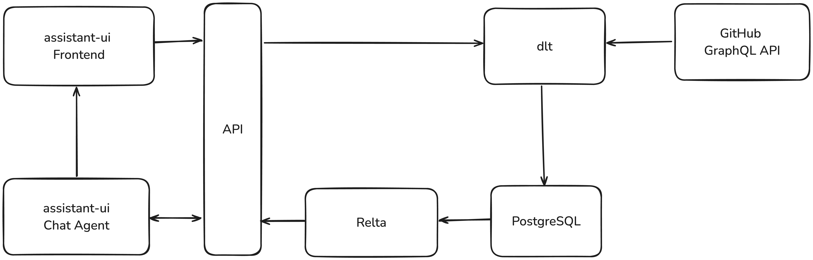

# github-assistant

github-assistant is a PoC built using [Relta](http://relta.dev) and [assistant-ui](assistant-ui.com). You can try it out [here](https://github-assistant.com) and read more about the project in this [blog](https://medium.com/relta/github-assistant-49ae388ad758).




The Relta sub-module is currently not open source. You can see the semantic layer that was generated by the library and is used in the text-to-SQL pipeline in the `server-poc/semantic_layer` folder. The full library is available upon request for both commercial and non-commercial uses. Send an email to amir [at] relta.dev for access.

## Requirements to run 

- Python 3.9+
- npm or other Node.js package manager
- Git

## Setup

1. Reach out to get access to the Relta submodule.

1. Initialize the `relta` submodule

```sh
git remote add template https://github.com/reltadev/poc-template.git && git submodule update --init --recursive
```

2. Create a virtual environment for Relta

```sh
python -m venv .venv && source .venv/bin/activate && pip install -r requirements.txt
```

3. Setup the `.env` files from `.env.example`

```sh
cp client-poc/.env.example client-poc/.env && cp server-poc/.env.example server-poc/.env
```

4. Set the following environment variables in `server-poc/.env`:
    - `OPENAI_API_KEY`: Your OpenAI API key
    - `GITHUB_DATABASE_CONNECTION_URI` the PG database where the GitHub data will be piped into

5. Launch the backend 

```sh
cd server-poc
uvicorn server_poc.server:app --host 0.0.0.0 --port 80 --reload4
```

5. Launch the front-end 

```sh
cd client-poc
npm install
npm run dev
```


## Updating

We will generally give instructions on how to update Relta or the POC to handle any bugs or new features.


## Contributing

We would love to get new contributors! If you are interested, please reach out to amir [at] relta.dev or simon.farshid [at] outlook.com
