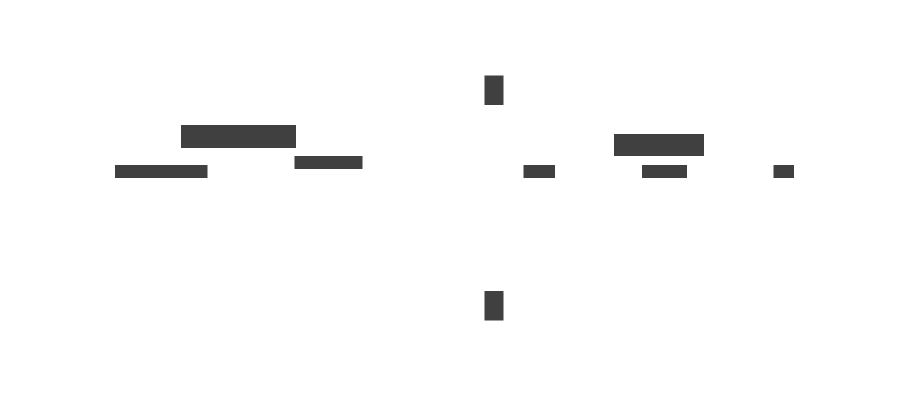

# Architecture

Relta is packaged as a Python library. The library exposes methods that are used to:

 1. Connect relational datasources and configure semantic layers from them at set-up 

 2. Implement natural language chat sessions during runtime 

During set-up, `DataSource` and `SemanticLayer` objects are configured and automatically stored in a `.relta` folder in your repo. These will get copied into each Python process spun up during runtime, allowing each user session to access the latest configuration of connected `DataSource` and `SemanticLayer` objects. At runtime Relta will also spin up and store in-process DuckDB instances in the `.relta` folder which will be used to create a sandboxed replica of that user's data from the underlying datasource.

There is currently no stand-alone server version of Relta. However, the CLI provides convenient interfaces for initial set-up. 

We suggest the following implementation:

1. Configure Relta using the CLI in your backend repository: 
    - Define all the `DataSource` objects that you want to use with Relta.
    - Generate the `SemanticLayer` objects for each `DataSource` object using the CLI
    - Write any other changes to `Configuration` to `pyproject.toml`
2. Use the `Client` object in your backend code to create secure sandboxed databases and implement chat sessions:
    - Fetch relevant `DataSource` and `SemanticLayer` objects using `get_datasource`   
    - Create a local, sandboxed database with the user's data using `deploy` 
    - Create a chat for the user with `create_chat` 
    - Refine the `SemanticLayer` from user feedback using the `.feedback` method on a `Response` object, which is returned from `chat.prompt`.

!!! warning "One Relta Client per Python Process"
    A current limitation of Relta is that there should only be one `relta.Client` instance per Python process, implying that only one Python process should be used per user.

!!! info "Relta Server"
    We are working with select customers to design a server that batches feedback, caches user sessions, and persists chat histories. If you are interested in this design partnership, please reach out to us [at this link.](https://www.relta.dev/#:~:text=the%20semantic%20layer.-,Get%20in%20touch,-Name)

---

[^1]: <a href="https://www.flaticon.com/free-icons/brain" title="brain icons">Brain icons created by Umeicon - Flaticon</a>
