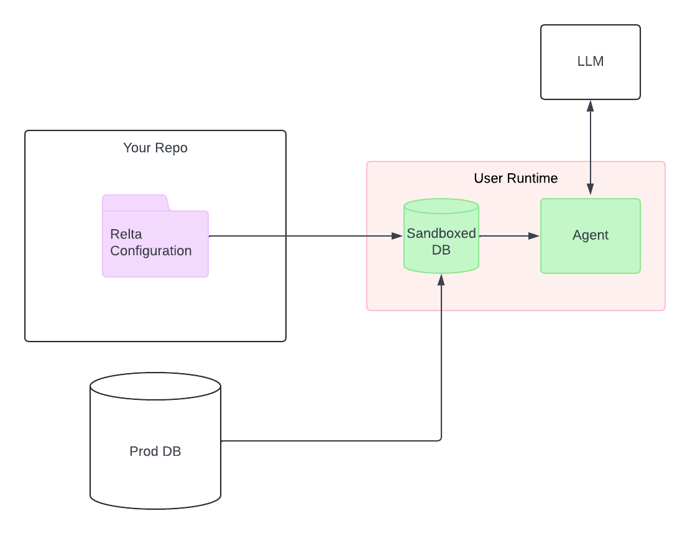

#

    
    

Relta is a Python library for building accurate and secure natural language interfaces to relational data. For example, you can use Relta to:

<!-- link these to examples -->

- Set up chat interfaces on your SaaS using assistant-ui
- As a tool call in a LangChain or OpenAI Assistant API agent

Relta has these key features:

1. **High Accuracy**: you define the set of metrics from the underlying datasource. Relta will answer questions from those metrics reliably and nothing else. You do not need to train a model. 
2. **Per-user sandboxing**: Relta automatically creates sandboxed in-memory databases per user, so no LLM-produced SQL is ran against your production database.
3. **Easy feedback**: when users provide feedback, Relta automatically raises a PR to fix the metrics on your GitHub repository.

Relta currently works with Postgres, MySQL, CSV, and Parquet data.
<!-- Relta is built to deliver high accuracy for specified metrics and per-user privacy out of the box. Relta does this by: -->
<!-- Exactly defining the SQL that Relta can output for any given metric in a semantic layer. You do not need to manually train Relta. -->

    

